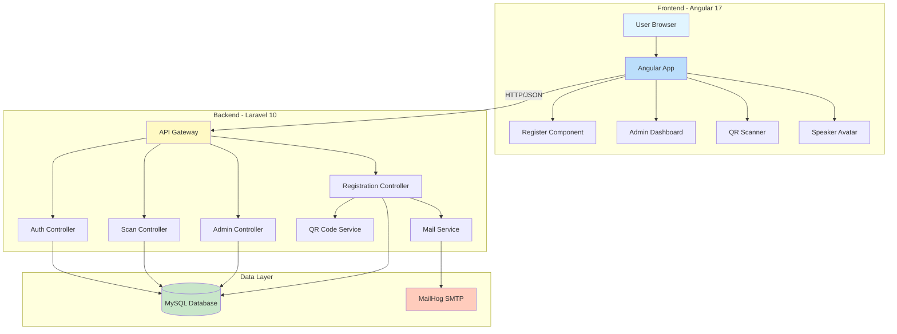
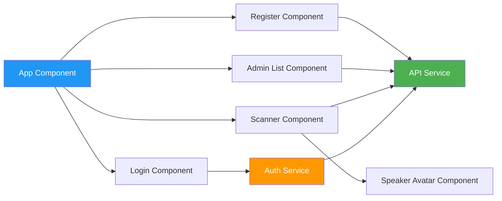
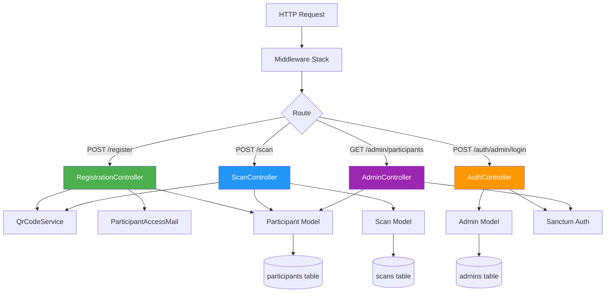
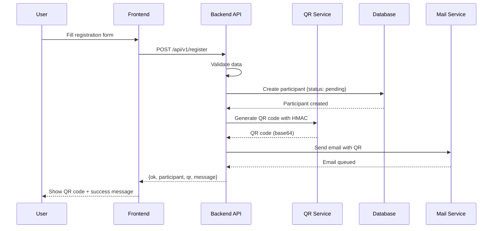
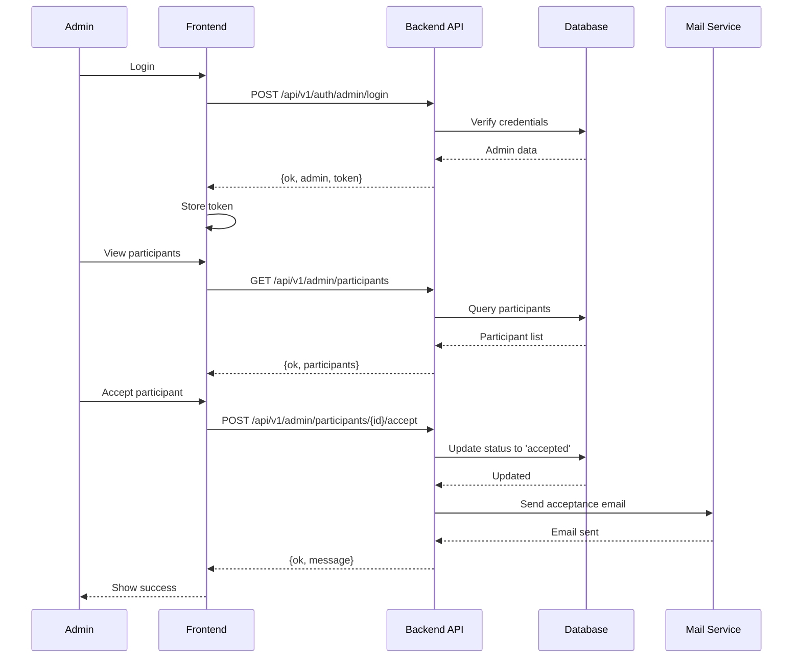
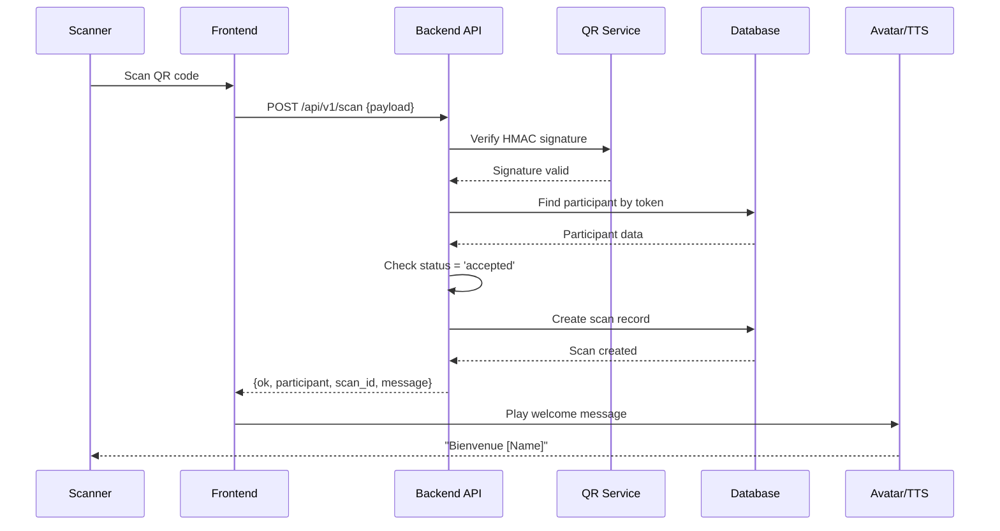
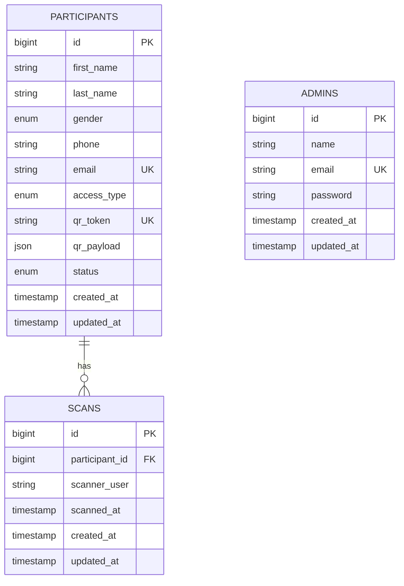
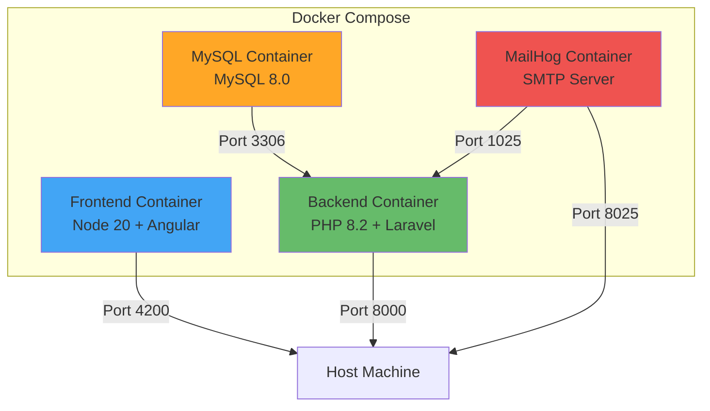

# Event Access - Architecture Documentation

## System Overview

Event Access is a full-stack web application for managing event registrations with QR code-based access control. The system consists of a Laravel backend API, an Angular frontend, and a MySQL database, all containerized with Docker.

## Architecture Diagram



## Component Architecture

### Frontend Components



### Backend Architecture



## Data Flow

### Registration Flow



### Admin Approval Flow



### QR Scanning Flow



## Database Schema



## Security Architecture

### QR Code Security

1. **HMAC-SHA256 Signature**: Each QR code contains a signed payload
   - Format: `base64url(payload).base64url(signature)`
   - Secret key stored in environment variable
   - Constant-time comparison prevents timing attacks

2. **Payload Structure**:
   ```json
   {
     "participant_id": 123,
     "email": "user@example.com",
     "access_type": "both",
     "issued_at": "2025-01-01T12:00:00Z"
   }
   ```

### Authentication

1. **Laravel Sanctum**: Token-based authentication for admin routes
2. **CORS**: Restricted to frontend URL only
3. **Rate Limiting**:
   - Registration: 5 requests/minute
   - Login: 5 requests/minute
   - Scan: 30 requests/minute

### Data Protection

1. **Password Hashing**: Bcrypt for admin passwords
2. **HTTPS**: Required in production
3. **Input Validation**: Server-side validation for all inputs
4. **SQL Injection Protection**: Eloquent ORM with parameter binding

## Technology Stack

### Frontend
- **Framework**: Angular 17 (Standalone Components)
- **HTTP Client**: Angular HttpClient
- **QR Scanning**: @zxing/browser
- **TTS**: Web Speech API
- **Styling**: Custom CSS with responsive design

### Backend
- **Framework**: Laravel 10
- **PHP Version**: 8.2
- **Authentication**: Laravel Sanctum
- **QR Generation**: simplesoftwareio/simple-qrcode
- **Email**: Laravel Mail with MailHog (dev)

### Database
- **DBMS**: MySQL 8.0
- **ORM**: Eloquent
- **Migrations**: Laravel Migrations

### Infrastructure
- **Containerization**: Docker & Docker Compose
- **Web Server**: PHP Built-in (dev), Nginx (prod)
- **Process Manager**: None (dev), Supervisor (prod)

## Deployment Architecture



## Scalability Considerations

### Current Architecture (MVP)
- Single server deployment
- Synchronous email sending
- In-memory session storage

### Future Enhancements
1. **Queue System**: Redis + Laravel Queue for async email
2. **Load Balancing**: Multiple backend instances behind Nginx
3. **Database Replication**: Master-slave MySQL setup
4. **CDN**: Static assets served via CDN
5. **Caching**: Redis for session and data caching
6. **Microservices**: Separate QR generation service

## Monitoring & Logging

### Logging Strategy
- **Application Logs**: Laravel log files (daily rotation)
- **Scan Logs**: Dedicated `scans.log` channel
- **Error Tracking**: Laravel exception handler
- **Access Logs**: Web server access logs

### Health Checks
- **Endpoint**: `/api/health`
- **Checks**: Database connectivity, disk space
- **Response**: JSON with status and timestamp

## Assumptions & Design Decisions

See [assumptions.md](./assumptions.md) for detailed assumptions and design decisions.
